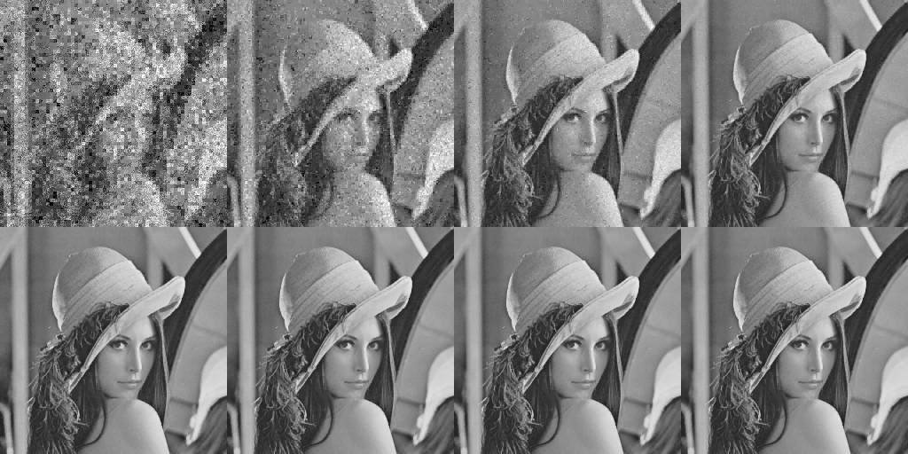
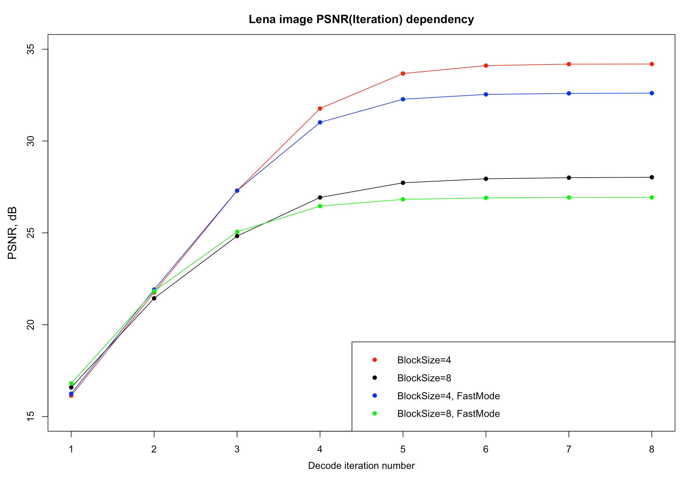
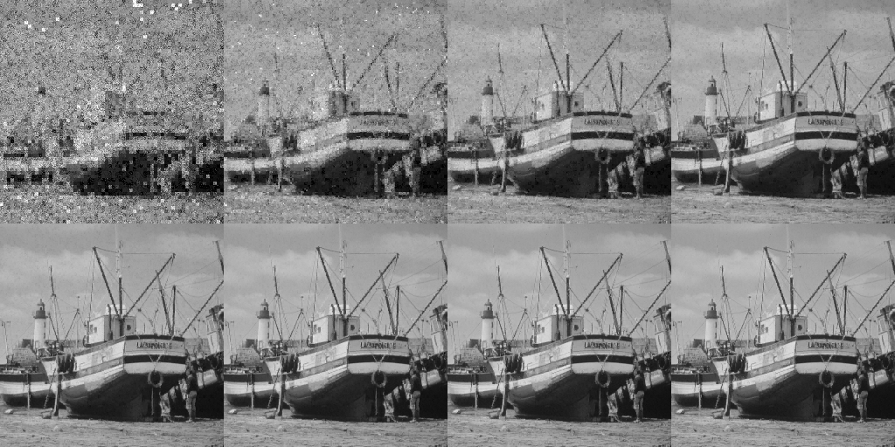
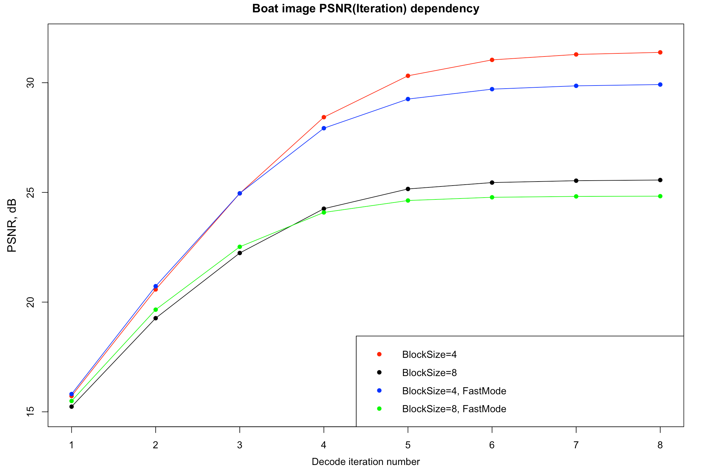
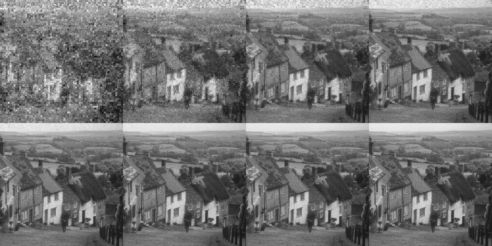
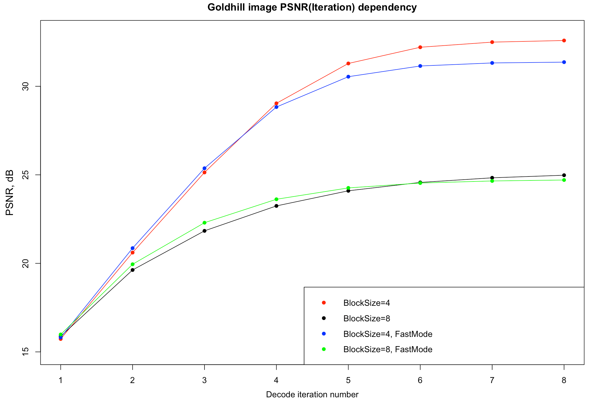

## Задание №2 по курсу "Анализ и обработка изображений".

Реализован алгоритм фрактального кодирования/декодирования изображения размером 256x256 пикселей.
В кодировании при поиске блоков-прообразов D выполняется полный перебор по всему изображению по всем возможным 8 ориентациям блоков. Подбор яркостных параметров преобразования осуществляется регрессией, минимизируется метрика MSE.

Каждый маппинг (задаваемый на одном подблоке изображения) кодируется 4 байтами:
1. 2 байта - позиция блока-прообраза на изображении (координаты верхнего левого угла).
3. 3 бита - ориентация блока (4 возможных поворота * 2 возможных варианта без/с отражением).
4. 5 бит - параметр контраста (Задается [0,1] по основанию 32).
5. 8 бит - параметр сдвига, дискретизуется [-128,127].

Размер блока R задается равным 4 или 8 пикселям. (По умолчанию равен 4).

Помимо полного перебора блоков по всему изображению реализован "быстрый" вариант алгоритма с использованием хэшей. В таком режиме поиск выполняется только среди блоков с одинаковым хэшом. Исключение составляют блоки R c очень маленькой дисперсией - для них перебор все равно идет по всем блокам. (По умолчанию быстрый режим выключен)

## Запуск кода

### 1. Энкодер
FractalEncoder PathToSrcImage PathToEncoded <BlockSize(optional, 4 or 8)> <FastMode(optional)>

Параметры:
1. PathToSrcImage - путь к исходному изображению
2. PathToEncoded - путь к файлу-результату с закодированным изображением
3. BlockSize - размер блока.
4. FastMode - включать ли быстрый режим поиска блоков.

Запуск на примере изображения Lena.bmp:

FractalEncoder ./source_images/Lena.bmp ./results/Lena[R=8,FastMode]/encoded.frac 8 FastMode

FractalEncoder ./source_images/Lena.bmp ./results/Lena[R=4]/encoded.frac

### 2. Декодер
FractalDecoder PathToEncoded PathToResult <ReferencePath(optional)> <PathToResultsFolder(optional)> <IterNumber(optional, default=8)>

Параметры:
1. PathToEncoded - путь к файлу с закодированным изображением.
2. PathToResult - имя файла для сохранения итогового результата (без расширения .bmp)
3. ReferencePath - путь к оригинальному изображению, передается, если нужно посчитать метрики (MSE/PSNR).
2. PathToResultsFolder - директория, куда сохранять промежуточные изображения и метрики.
4. IterNumber - число итераций при восстановлении.

Запуск на примере изображения Lena.bmp:

FractalDecoder ./results/Lena[R=8,FastMode]/encoded.frac ./results/Lena[R=8,FastMode]/decoded ./source_images/Lena.bmp ./results/Lena[R=8,FastMode] 10

FractalDecoder ./results/Lena[R=4]/encoded.frac ./res_lena

## Результаты работы:

Далее в картинках приводятся результаты лучшего по качеству варианта - полный перебор, размер блока 4, а также графики зависимости PSNR от номера итерации восстановления (для всех сценариев). Полные результаты всех вариантов запуска можно найти в поддиректориях директории /results.

### Lena

### Boat

### Goldhill

## Время работы

### Энкодер

Image   | BlockSize = 4 | BlockSize = 8 | BlockSize = 4, FastMode | BlockSize = 8, FastMode |
------- | ------------- | ------------- | ----------------------- | ----------------------- |
Lena | 47.6 sec | 20.5 sec | 18.6 sec | 5.1 sec |
Boat | 48.4 sec | 20.7 sec | 21.5 sec | 6.7 sec |
Goldhill | 49.1 sec | 21.0 sec | 12.0 sec | 4.3 sec |

### Декодер

6 msec для 8-ми итераций при декодировании из блоков размера 8.

6.5 msec для 8-ми итераций при декодировании из блоков размера 4.

Время измерялось на процессоре Intel Core i7-9750H, код компилировался с помощью Clang 12.