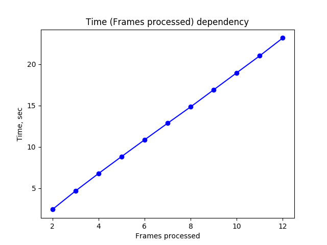
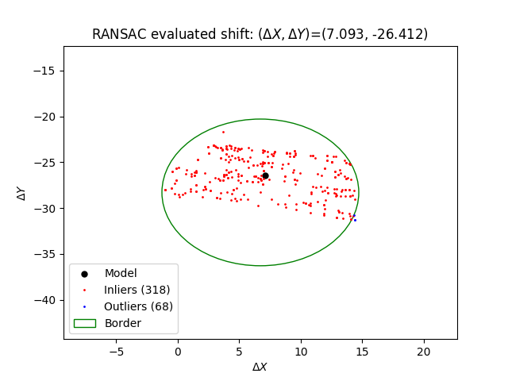

## Задание №4 по курсу "Анализ и обработка изображений".

Реализован алгоритм, оценивающий межкадровые сдвиги с помощью сопоставления ключевых точек, полученных детектором SIFT. Соответствия ключевых точек строятся между первым кадром и всеми последующими, используется полный пебебор с отсечением пар по отношению расстояний между дескрипторами для двух ближайших соседей. Для оценки параметров модели (глобального вектора перемещения) используется метод RANSAC - каждая пара ключей задает собственную модель, разделение на inliers/outliers выполняется по евклидовому расстоянию на плоскости.

## Запуск кода

python frames_match.py -fp ./src_frames -rp ./results

Параметры:
1. FramesPath (-fp) - путь к директории с исходными кадрами
2. ResultsPath (-rp) - путь к директории с результатами

## Результаты работы:

Сдвиги для каждого кадра сохранены в папке ./results/shifts. Направления осей стандартные, ox - направлена вправо, oy - вниз. В папке ./results/visualizations приведены визуализации алгоритма RANSAC - разделение точек на inliers/outliers для выбранной модели для каждого кадра. Также для иллюстрации построены изображения с учетом компенсации относительного движения между кадрами - они сохранены в директории ./results/balanced_imgs, из них составлены gif-изображения (FPS=6, находятся в директории ./results).

### Скомпенсированное движение

### Исходные кадры

## Время работы:

Зависимость общего времени работы от числа обработанных кадров линейная.

Всего на обработку 12 кадров потребовалось 25.3 секунд времени (Python).

## Анализ

Можно сделать вывод, что выбранная модель глобального сдвига слишком простая и в данном случае плохо подходит.

Рассмотрим в качестве примера сдвиг последнего кадра относительно первого:

Рисунок 1. Здесь первый и последний кадры смешаны в пропорциях 7:3 соответственно.

Рисунок 2. Вместо исходного последнего кадра возьмем его сбалансированную версию.

Видно, что в данном случае нельзя сделать идеальный мэтчинг одним только сдвигом - правые части верхних двух строк сопоставились хорошо, но при этом первые слова Little уплыли вправо - текст не только был сдвинут, но и стал меньше в результате отдаления камеры от плоскости документа, сжатие также наблюдается и по вертикали - нижние строки текста лежат выше тех же строк на первом кадре.

Посмотрим на визуализацию алгоритма RANSAC для того же самого последнего кадра.

Очевидно, выбранная модель не слишком уверенная. Примерно с таким же успехом можно взять почти любую точку из центральной части рисунка, не потеряв значительного числа пар ключей - точки в принципе разбросаны достаточно равномерно. Если мы это сделаем, мы просто хорошо сопоставим другие буквы текста, но значительная часть остального текста все равно останется сдвинутой.

