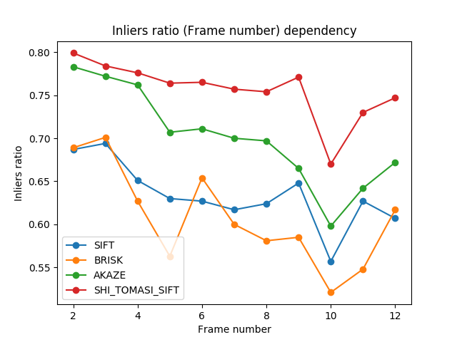

## Задание №5 по курсу "Анализ и обработка изображений".

Реализован алгоритм оценки воспроизводимости детектора ключевых точек. Воспроизводимость отдельно взятой особой точки – доля кадров, в которых она обнаруживается. Среднее по всем особым точкам – repeatability детектора. Для заданной последовательности кадров строится геометрическая модель движения (глобальный вектор перемещения) с использованием метода RANSAC (каждая пара ключей задает собственную модель, разделение на inliers/outliers выполняется по евклидовому расстоянию на плоскости). Пары-Inlier-ы построенной модели считаются воспроизведенными точками.

Посчитана repeatability детекторов SIFT; BRISK; AKAZE; SHI_TOMASI(GFTT) с использованием дескриптора SIFT. Построены графики зависимости долей точек первого кадра, воспроизведенных в i-м кадре.

## Запуск кода

python ./calc_feature_repeatability.py -fp ./src_frames -rp ./results -dt SIFT

Параметры:
1. FramesPath (-fp) - путь к директории с исходными кадрами
2. ResultsPath (-rp) - путь к директории с результатами
3. DetectorType (-dt) - тип детектора ключевых точек (возможные варианты: [SIFT|BRISK|AKAZE|SHI_TOMASI])

## Результаты:

Результаты работы каждого детектора лежат в одноименных поддиректориях директории ./results.
В папках ./results/<DETECTOR_TYPE>/ransac_viz приведены визуализации алгоритма RANSAC - разделение точек на inliers/outliers для выбранной модели для каждого кадра. Также для иллюстрации построены изображения с учетом компенсации относительного движения между кадрами - они сохранены в директориях ./results/<DETECTOR_TYPE>/balanced_imgs, из них составлены gif-изображения (FPS=6).

### Repeatability детекторов по всем кадрам, время работы в пересчете на одну особую точку

Detector | Repeatability | Time (per point), * 10^(-5) sec |
:--------: | :-------------: | :----------------: |
SIFT | 0.634 | 2.25
BRISK | 0.608 | 0.99
AKAZE | 0.701 | 1.75
SHI_TOMASI (SIFT) | 0.756 | 0.43 

### Графики для доли воспроизведенных в i-м кадре точек

### Скомпенсированное движение (Для различных детекторов)

| **SIFT**             |  **BRISK** |
| :-------------------------: | :-------------------------: |
  |  
| **AKAZE** | **SHI_TOMASI (SIFT)** |
  |  
