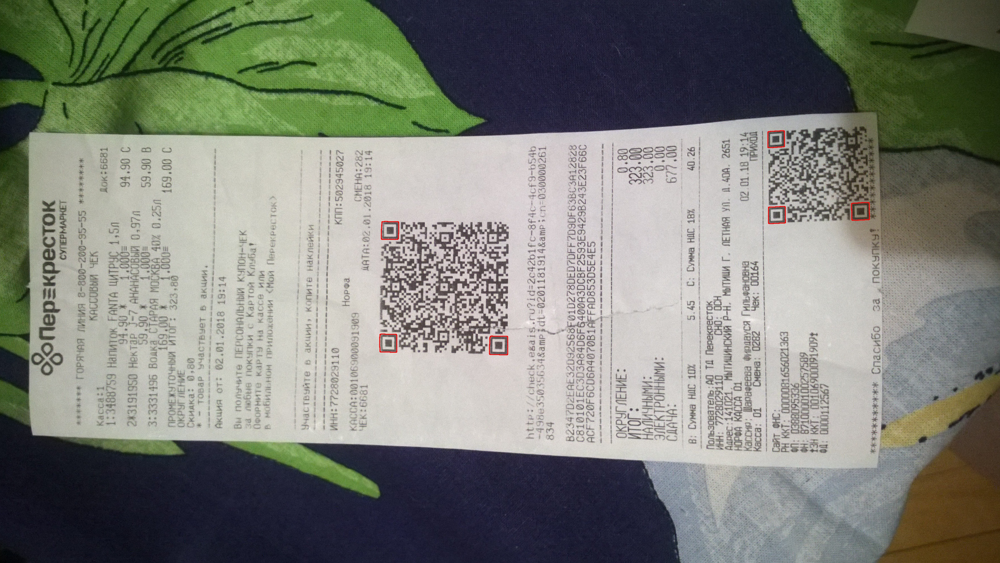

## Задание №6 по курсу "Анализ и обработка изображений".

Реализован эвристический алгоритм детекции finder-паттернов QR-кода на изображении:

1. Бинаризуем серое изображение, далее работаем с ЧБ.
2. Применяем медианный фильтр небольшого радиуса для удаления лишнего шума.
3. Независимо по каждому направлению (горизонтали и вертикали) ищем последовательности черных и белых штрихов, имеющие пропорции длин, близкие к пропорциям правильной проекции finder-паттерна 1-1-3-1-1.
4. Строим изображение-маску, состоящее из объединения центральных штрихов горизонтальных и вертикальных последовательностей, полученных на предыдущем пункте, причем в объединение включаем только те штрихи, которые имеют значительное пересечение со штрихами протиположного направления.
5. Извлекаем связные компоненты с полученной маски.
6. Отсекаем среди компонент все сильно неквадратное, а также неплотные компоненты, имеющие очень маленькую площадь по отношению к описывающему прямоугольнику. После этих фильтраций среди компонент остаются только центральные квадраты finder-паттернов.
7. Остается найти регионы внешних рамок, рассматриваем достаточно большую окрестность вокруг каждого квадрата, ищем внутри нее связную компоненту наибольшей площади - это и есть искомая рамка.

## Запуск кода

python detect_finder_patterns.py -ip ./images_test2 -rp ./results_test2 -mp ./annotation/test2_annotation.json -el

Параметры:
1. ImagesPath (-ip) - путь к директории с изображениями, на которых нужно запустить поиск.
2. ResultsPath (-rp) - путь к директории с результатами работы.
3. MarkupPath (-mp) - путь к json-файлу с разметкой описывающих прямоугольников объектов, опциональный параметр. Если задан, рассчитываются метрики детекции и сохраняются в файл metrics.txt
4. EnableLogs (-el) - опциональный флаг, включены ли логи. Если включены, в результатах будет создана папка /logs с визуализациями промежуточных этапов алгоритма детекции для каждого изображения.

## Результаты работы

Результаты работы на выданной выборке находятся [здесь](
https://drive.google.com/drive/folders/1VyYlaSKrsqBYMqyghB2Kg4ulhn2NtYlC?usp=sharing).

### Пример работы:

### Метрики на имеющейся выборке:

Samples | Precision | Recall | F-measure |
:--------: | :-------------: | :----------------: | :-------: |
Test1 | 1.000 | 0.972 | 0.986
Test2 | 1.000 | 0.939 | 0.968
Both | 1.000 | 0.955 | 0.977

### Анализ ошибок

Алгоритм не справляется с поврежденными паттернами, которые были напечатаны с дефектами. При работе с ЧБ-изображением с этим сложно побороться. Проблему можно частично решить при помощи дилатации, однако вместе с ней мы также начнем приклеивать к паттернам текст, расположенный близко к краям баркода.

## Результаты работы на тестовой выборке

Изначально алгоритм показал очень низкий результат на тестовой выборке

Samples | Precision | Recall | F-measure |
:--------: | :-------------: | :----------------: | :-------: |
Test3 | 0.929 | 0.704 | 0.801

Как оказалось, столь сильное проседание качества связано не с самим алгоритмом, а с качеством бинаризованных картинок. На подавляющем большинстве тестовых примеров, где finder-паттерны не были найдены, после бинаризации в центре паттернов образовывалась белая дырка. А поскольку алгоритм главным образом опирается именно на поиск центральных квадратов, такая бинаризация является неприемлимой для корректной детекции.

В качестве бинаризации используется локально-адаптивная бинаризация библиотеки opencv, для каждого пикселя дырки описывающий блок лежит полностью внутри самого квадрата (в него не попадают фоновые пиксели серединной рамки), из-за чего порог получается заниженным. Таким образом, размер блока бинаризации фактически определяет для нас максимальный размер паттерна в пикселях, который мы все еще можем нормально бинаризовать и детектировать.

Исходный выбранный параметр был выбран "размер блока = 63", этого было достаточно на исходных данных, но оказалось недостаточно на новой выборке. Поэтому параметр был увеличен до 129. Ниже приведен один из примеров новой выборки (test_set3, изображение 75), где бинаризация играет ключевую роль: слева - исходное изображение, по центру - плохо бинаризованное (размер блока = 63), справа - хорошо бинаризованное (размер блока = 129).

Алгоритм был повторно протестирован с новым параметром бинаризации, параметры самого алгоритма детекции были оставлены без изменений.

Samples | Precision | Recall | F-measure |
:--------: | :-------------: | :----------------: | :-------: |
Test3 | 0.993 | 0.971 | 0.982

Повторный прогон алгоритма на исходных выборках:

Samples | Precision | Recall | F-measure |
:--------: | :-------------: | :----------------: | :-------: |
Test1 | 0.993 | 0.979 | 0.986
Test2 | 1.000 | 0.925 | 0.961
Both (Test1 + Test2) | 0.996 | 0.952 | 0.974

Итого, на исходных выборках изменения минимальные (+- 1-2 паттерна), на тестовой выборке качество выправилось. Если не считать нюанса с параметром бинаризации, сам алгоритм достаточно хорошо обобщился на новую выборку (test3).

Результаты работы алгоритма (с измененной бинаризацией) выложены на [гугл-диск](
https://drive.google.com/drive/folders/1VyYlaSKrsqBYMqyghB2Kg4ulhn2NtYlC?usp=sharing).